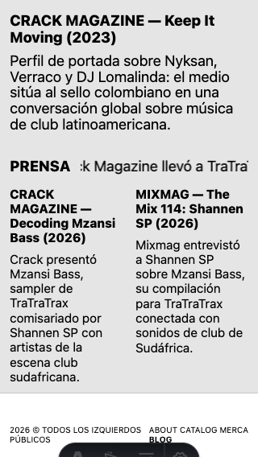
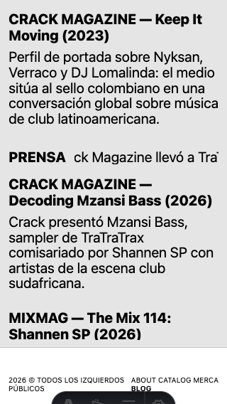
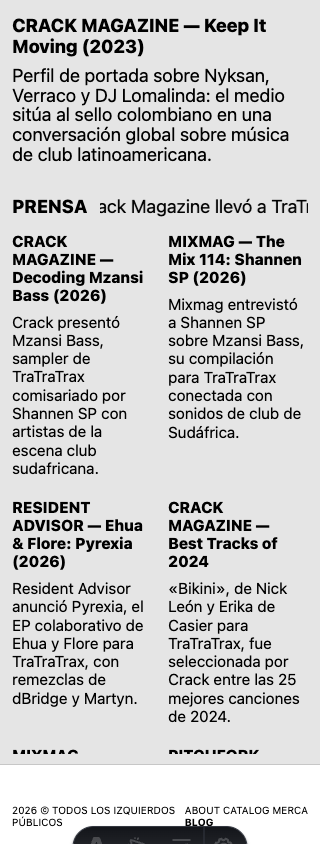
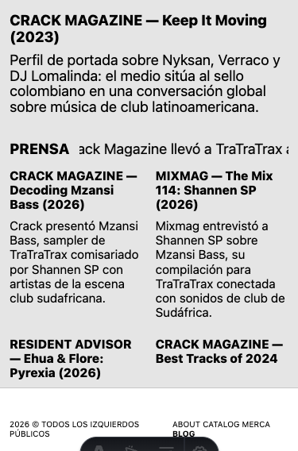
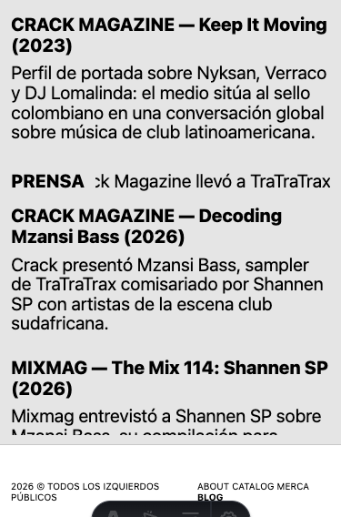
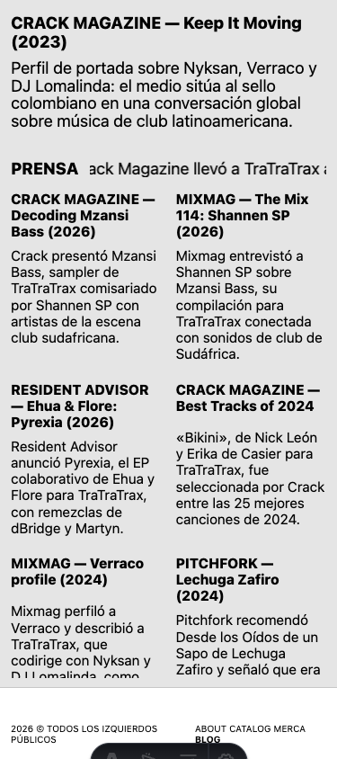
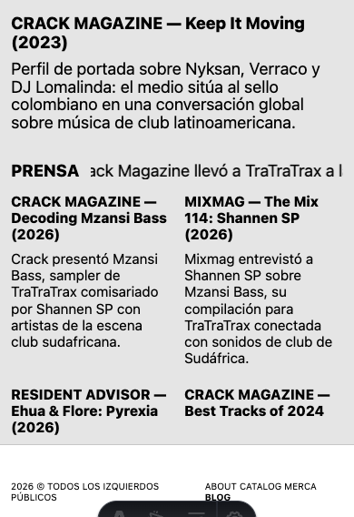
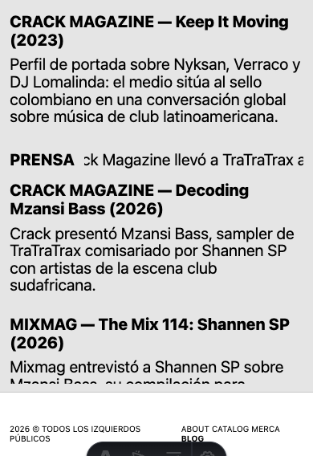
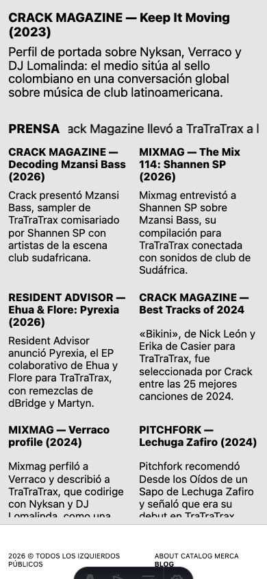

# P4 — Dos propuestas del blog móvil

Estado: **comparación para elección visual; ninguna variante está fijada en Cargo**. Fecha: 24-09-2026.

Las dos vistas usan el mismo `data/blog.json`: un destacado y las 14 lecturas visibles restantes, en orden de `order`. Se abren en el preview local con [`?variante=a`](http://127.0.0.1:4321/tratratrax-web/preview/blog?variante=a) y [`?variante=b`](http://127.0.0.1:4321/tratratrax-web/preview/blog?variante=b). El atributo de variante solo se coloca en ese preview; el placeholder de Cargo no lo lleva.

- **A (preferida por Silvi):** bloque superior de 18,4 px y archivo de 15,5 px en dos columnas iguales, recorrido por filas de izquierda a derecha. Las dos columnas comparten tamaño y peso tipográfico.
- **B:** 20 px en toda la página, incluido el archivo, en una columna. Frente a los 18,4 px del bloque superior de A, el aumento es de aproximadamente 9 %.
- En ambas, el destacado y PRENSA quedan fuera del scroll del archivo. El archivo muestra un scrollbar fino y admite gesto táctil, rueda y teclado al enfocarlo. Los enlaces tienen un área mínima de 44 px de alto, los textos se envuelven y no hay elipsis.

## Capturas comparables

Cada par se tomó con Chrome móvil emulado, escala de dispositivo 1, mismo ancho y alto. «Inicio» muestra el scroll del archivo en cero. La barra inferior de 80 px es la aproximación del preview, no el DOM de navegación de Cargo.

| Viewport | A · dos columnas | B · una columna |
|---|---|---|
| 320 × 568 |  |  |
| 320 × 844 |  |  |
| 375 × 568 |  |  |
| 375 × 844 |  |  |
| 390 × 568 |  |  |
| 390 × 844 |  |  |

Última lectura tras desplazar el archivo hasta el final: [A 320×568](p4-evidence/a-320x568-final.png), [B 320×568](p4-evidence/b-320x568-final.png), [A 390×844](p4-evidence/a-390x844-final.png), [B 390×844](p4-evidence/b-390x844-final.png).

## Alto y comportamiento

El alto del archivo es su área visible, antes de desplazarlo. «Recorrido» es el scroll máximo dentro del archivo. La nav comienza en `alto de viewport − 80 px` en todas las capturas.

| Viewport | A: archivo / recorrido | B: archivo / recorrido | Nav desde y |
|---|---:|---:|---:|
| 320 × 568 | 258 / 1492 px | 244 / 2185 px | 488 px |
| 320 × 844 | 534 / 1216 px | 520 / 1909 px | 764 px |
| 375 × 568 | 278 / 1161 px | 266 / 2009 px | 488 px |
| 375 × 844 | 554 / 885 px | 542 / 1733 px | 764 px |
| 390 × 568 | 278 / 1142 px | 266 / 1983 px | 488 px |
| 390 × 844 | 554 / 866 px | 542 / 1707 px | 764 px |

El alto superior en A mide 160 px a 320 y 140 px a 375/390; en B, 172 y 151 px. PRENSA mide aproximadamente 25 px en A y 26 px en B. La página completa no se desplaza (`scrollY = 0`, `scrollHeight` igual al alto del viewport): el movimiento está contenido en el archivo. El último artículo queda completamente por encima del borde inferior del archivo y de la nav al llegar al final. No hubo desborde horizontal.

En 320 × 568 se comprobó además que los 14 enlaces del archivo se pueden llevar al área visible y tocar; el destacado, PRENSA y la nav conservaron su coordenada vertical durante el recorrido. El orden DOM y de tabulación sigue el orden editorial, de izquierda a derecha y de arriba abajo en A. Las capturas y medidas completas están en [medidas.json](p4-evidence/medidas.json).

## Recomendación pendiente de elección

**Recomiendo A.** La prueba no mostró lecturas inaccesibles ni texto truncado; A ofrece más lecturas a la vista y exige menos recorrido. En 320 px las líneas de cada columna son cortas, pero la letra del archivo sigue en 15,5 px y ambas columnas tienen la misma escala. B ofrece una lectura más holgada y puede elegirse si esa densidad visual no convence a la persona responsable. Falta su elección antes de aplicar una variante al blog de Cargo; la nav final y el comportamiento en iOS/Android se verifican en P5 con la variante elegida.
