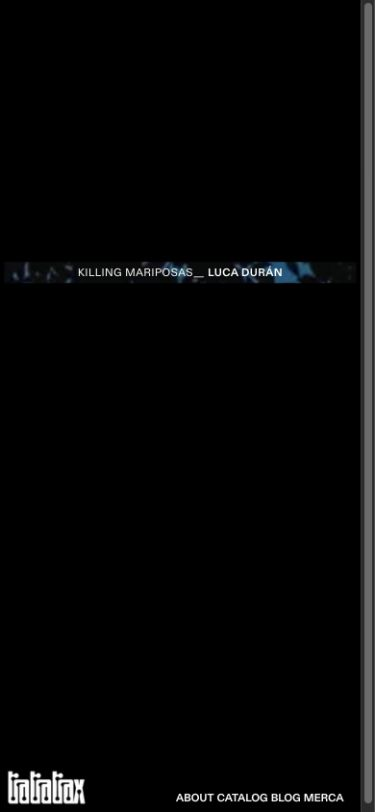
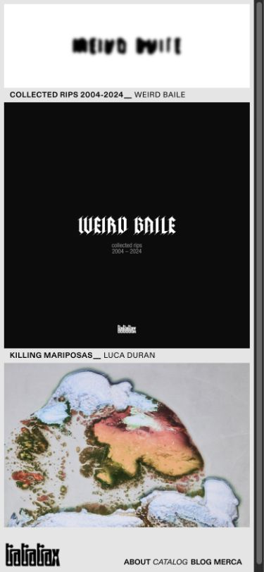
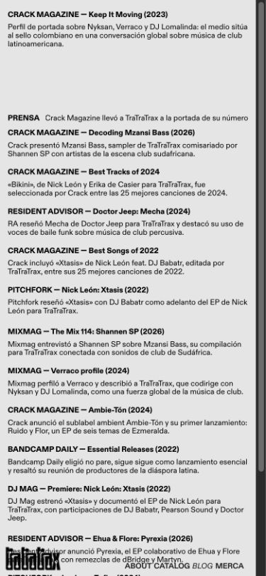

# TraTraTrax · manual integrado

**Versión:** 24-09-2026 (Bogotá). [Índice bilingüe y estado de verificación](README.md). Enlaces públicos: [sitio](https://tratratrax.cargo.site/) · [Studio](https://tratratrax-web.netlify.app/).

## Índice

1. [Uso del sitio público](#1-uso-del-sitio-público): [recorrido](#recorrido-de-páginas), [navegación](#navegación-en-escritorio-y-móvil), [comprobación](#repetir-el-recorrido).
2. [Actualizar contenidos](#2-actualizar-contenidos): [mapa de edición](#qué-se-edita-dónde), [Studio](#trabajar-en-tratratrax-studio), [Merca en Cargo](#merca-en-cargo), [publicación](#comprobar-el-resultado).

## 1. Uso del sitio público

<video controls preload="metadata" width="720"><source src="media/es-sitio.mp4" type="video/mp4"><track kind="captions" src="media/es-sitio.vtt" srclang="es" label="Español" default></video>

[Vídeo: recorrido del sitio, 00:24](media/es-sitio.mp4) · [Guion editable](guiones/es-sitio.md). Las imágenes son capturas originales fechadas; las interacciones se pueden repetir con las instrucciones siguientes.

### Recorrido de páginas

| Ruta publicada | Qué muestra y qué hacer |
|---|---|
| [`/`](https://tratratrax.cargo.site/) | **Landing**, un cañaveral a pantalla completa. Mover el puntero y cortar con el machete para iniciar la entrada del nav; en primera visita aparece de forma gradual. El logo del nav lleva a Home. No confundir esta ruta con el slug interno `/landing` del editor. |
| [`/home`](https://tratratrax.cargo.site/home) | **Home** destaca un release del catálogo. En reposo se ve la franja con título y arte/vídeo. En escritorio, poner el puntero sobre la franja abre la grieta: arte y vídeo ocupan los dos módulos; al salir se cierra y la siguiente entrada invierte la composición. `BUY` y `LISTEN` abren destinos externos si están configurados. El título abre el release en `/catalog` solo si es visible allí. En táctil, mantener pulsada la franja abre y soltar la cierra; sin actividad, el móvil muestra destellos automáticos breves. |
| [`/about`](https://tratratrax.cargo.site/about) | Las sílabas `TRA · TRA · TRAX` dejan una grieta. Al pasar el puntero por ella se cierra y revela lema, redes y correo; en móvil se toca para abrir y se toca fuera para cerrar. Al pasar por cada fundador aparece su emblema; **el enlace a Instagram está en el emblema**, no en el nombre. Revisar los destinos antes de salir del sitio. |
| [`/catalog`](https://tratratrax.cargo.site/catalog) | Visor de carátula arriba, etiquetas en la banda y carril horizontal abajo. Arrastrar con ratón, deslizar con dedo, usar trackpad o rueda sobre el carril; también funcionan flechas de teclado cuando el carril tiene foco. Pulsar etiqueta o carátula abre la ficha de créditos en el lugar; otra pulsación la cierra. El visor sigue la carátula que cruza el centro. `Purchase` y `Listen` abren enlaces externos en otra pestaña. |
| [`/blog`](https://tratratrax.cargo.site/blog) | Un **highlight** enlazado, la grieta/ticker `PRENSA` y archivo de artículos con enlaces a medios externos. En escritorio el archivo se reparte en tres columnas con scroll vertical propio; desplazar dentro de la columna que se quiere leer. En móvil, P5 dispone el archivo en un único flujo de dos columnas bajo highlight y grieta, con **un solo scroll interno**; si la altura disponible es insuficiente, se recupera el scroll de la página. El highlight y la grieta quedan arriba mientras se recorre el archivo. La captura móvil P5 documenta el preview y la prueba del bundle sobre Cargo, no una prueba en teléfono físico. |
| [`/merca`](https://tratratrax.cargo.site/merca) | Vitrina de Cargo en un **overlay** anclado a la banda del sitio. Abrir desde el nav o URL directa; tocar una tarjeta abre su ficha como otro overlay con hash propio; `CIÉRRAME` cierra la ficha y luego la vitrina. Comprobar el nombre, punto de stock, texto, control de compra y URL de cada ficha. No asumir que un rótulo `BUY` sea un enlace activo: algunas fichas usan texto/control propio. La quinta Tee observada en vivo está en revisión editorial y no es ejemplo de producto terminado. |

### Navegación en escritorio y móvil

El nav conserva logo y enlaces **About, Catalog, Blog y Merca**, con la página activa en itálica. El logo abre `/home`. En escritorio el lema se escribe y el hover del logo puede cubrir la pantalla con una bandera sin tapar el nav; fuera de Home puede asomarse una bandera tras inactividad. En móvil hay un solo logo a la izquierda y enlaces a la derecha: tocar enlaces, no depender de hover. La navegación de Cargo puede cambiar de página por AJAX; compruebe la marca activa tras cada cambio. Los links externos (comprar/escuchar, prensa e Instagram) abandonan el recorrido de Cargo.

### Repetir el recorrido

1. Abrir `/` directamente y después usar el logo para `/home`; registrar la transición de nav y el estado en reposo.
2. Recorrer Home → About → Catalog → Blog → Merca por el nav. Probar una interacción propia de cada página y volver al estado inicial. En Catalog, no confundir el scroll horizontal del carril con el scroll vertical de los créditos abiertos.
3. Repetir en viewport móvil de 390×844 con toques y deslizamientos. En Blog desplazar **solo el archivo** hasta el último artículo y volver al primero; comprobar que ningún contenido queda bajo el nav. Abrir y cerrar una ficha de Merca y confirmar su hash en la URL.
4. Registrar cualquier diferencia entre la página actual y las [capturas P2](../P2-NAV-CURSOR.md) / [evidencia P5](../P5-BLOG.md). Esas capturas tienen fecha y no sustituyen una inspección del estado recién publicado.

## 2. Actualizar contenidos

### Qué se edita dónde

| Superficie pública | Lugar de edición |
|---|---|
| Releases, orden y visibilidad del carril, carátula, créditos, compra/escucha | **TraTraTrax Studio → Catálogo**. |
| Release destacado y material de portada | **Studio → Home**; el material pertenece al mismo release de Catálogo. |
| Highlight, grieta/ticker y artículos del Blog | **Studio → Blog**. |
| Vitrina `/merca`, fichas, miniaturas, texto, imágenes y tags | **Cargo directamente**. Nunca Studio. |
| Landing, About, nav, banderas, diseño/CSS y estructura de páginas | **Fuera de Studio**; requieren mantenimiento de Cargo/código y revisión técnica. |

### Trabajar en TraTraTrax Studio

<video controls preload="metadata" width="720"><source src="media/es-studio.mp4" type="video/mp4"><track kind="captions" src="media/es-studio.vtt" srclang="es" label="Español" default></video>

[Vídeo: Studio, 00:18](media/es-studio.mp4) · [Guion editable](guiones/es-studio.md). El vídeo es una guía visual de pasos; los controles se contrastaron en Studio publicado, sin publicar un cambio de prueba.

1. Entrar a [Studio](https://tratratrax-web.netlify.app/). Si aparece la puerta, usar la contraseña entregada por el equipo; no ponerla en capturas. Abre **Catálogo**. En escritorio el botón `EN` cambia la interfaz a inglés y `ES` la devuelve; en móvil está en **⋯ → English/Español**.
2. En **Catálogo**, buscar un release o usar el carril/cuadrícula. Abrir su ficha para editar título, número, fecha, artistas, carátula, links, créditos y material de Home. `Visible en el sitio` controla si aparece en Catalog. **Añadir un lanzamiento** abre una ficha nueva; para ordenar, arrastrar su fila en el carril. Antes de borrar, comprobar referencias desde Home y Blog.
3. En **Home**, elegir **Fijo** y el release concreto, o **Aleatorio** y los releases habilitados. Un release oculto puede prepararse como destacado fijo, pero no saldrá en Catalog y su título no debe prometer una ficha pública. Revisar arte, vídeo, póster y texto de la grieta; el enlace **Abrir su ficha** conduce al mismo release en Catálogo.
4. En **Blog**, abrir **Highlight** para elegir artículo e imagen. Abrir **Grieta** para etiqueta, texto y URL. En **Artículos**, `+` crea, el título abre edición, `↑/↓` cambia el orden y `Visible/Oculto` controla la aparición. Revisar título, extracto y link externo. Eliminar es una acción editorial distinta de ocultar.
5. Pulsar **Vista previa** en la sección correspondiente; monta el widget sobre el borrador de la pestaña. Antes de guardar, abrir el estado de cambios de la barra para revisar pendientes, campos y referencias. Si otra persona guardó primero, seguir el aviso de conflicto, volver a cargar/comparar el estado remoto y aplicar solo los cambios deseados; no sobrescribir a ciegas.
6. Pulsar **Guardar cambios** una sola vez para todos los cambios de las secciones. El control se habilita cuando hay pendientes. Studio valida antes del commit; si señala un campo, corregirlo y repetir la vista previa. Guardar inicia publicación por el repositorio; esperar la actualización de Pages y la caché de Cargo antes de revisar el sitio público.

### Merca en Cargo

<video controls preload="metadata" width="720"><source src="media/es-cargo.mp4" type="video/mp4"><track kind="captions" src="media/es-cargo.vtt" srclang="es" label="Español" default></video>

[Vídeo: Cargo, 00:18](media/es-cargo.mp4) · [Guion editable](guiones/es-cargo.md). **Los pasos de tags se observaron en el editor**; no se cambió inventario durante la elaboración.

1. Abrir el editor del sitio Cargo con la cuenta autorizada. En el botón de menú superior derecho, abrir **Pages**. Buscar **Merca** (`Z4026822794`, ruta `/merca`) y abrirla: su grilla usa `thumbnail-index="tag:merch"`. No usar `/merch` como ruta de la vitrina.
2. En **Pages**, abrir cada ficha por nombre y **verificar ID, slug y contenido** antes de tocarla. Hay dos páginas `TEE CLÁSICA TRA`; la adicional `X0596556527` (`tee-clásica-tra-1`) contiene material mezclado y requiere decisión editorial. Las otras fichas identificadas son beach towel `H0731431535`, Tee `O1289033983`, scarf `H0993208634` y cassette `T2595752217`.
3. Editar texto e imágenes **solo tras aprobación editorial**. La ficha se edita en Cargo; la miniatura está en **Pages → clic derecho en ficha → Settings… → Thumbnail**. Conservar precios, destinos de compra y contenido previo hasta confirmación; no inferirlos del tag.
4. En ese mismo **Settings…**, localizar **Tags (separate by comma)**. Mantener `merch` para incluir la ficha en la grilla. Tras confirmación del equipo, dejar exactamente **uno** de `in-stock`, `few-units` u `out-of-stock`, separado por coma. Quitar tags de stock incompatibles. El tag se usa para la señal visual de la grilla; el rótulo de ficha solo está conectado automáticamente al tag en la beach towel comprobada. En las demás, rótulo y botón requieren revisión individual.
5. Guardar en el flujo de Cargo y revisar el borrador completo antes de publicar. No mover las fichas a un Set: una prueba cambió la ruta contenedora del overlay. Al publicar, abrir `/merca` directamente y desde el nav; comprobar una sola tarjeta por producto aprobado, miniatura, punto de stock, apertura/cierre, texto, control de compra, destino real si es enlace y hash/URL de **cada** ficha.

**Estado que exige atención:** en la inspección en vivo se veían cinco tarjetas, incluida la Tee adicional. El respaldo anterior tenía cuatro. Además, la Tee `O1289033983` llevaba `out-of-stock` y mostraba `Buy €35`; la scarf `H0993208634` llevaba `few-units` y decía “Sold out”. No corregir esas discrepancias sin confirmación de inventario y texto. [Detalle y respaldo](../../cargo/snippets/merca-estado.md).

### Comprobar el resultado

Tras un guardado real, cargar de nuevo `/home`, `/catalog`, `/blog` o `/merca` **por URL directa y por el nav**, según lo editado. Comparar la vista previa con el sitio publicado en escritorio y móvil. Para un release, verificar visibilidad, orden, portada, créditos y ambos destinos externos; para Blog, highlight, grieta, orden y último artículo; para Merca, los cinco puntos enumerados por ficha. Si no coincide, revisar primero el estado de publicación y el borrador antes de volver a editar. [Lista completa de pasos comprobados y pendientes](README.md#comprobación-y-límites).
